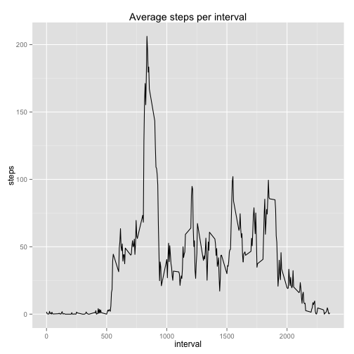
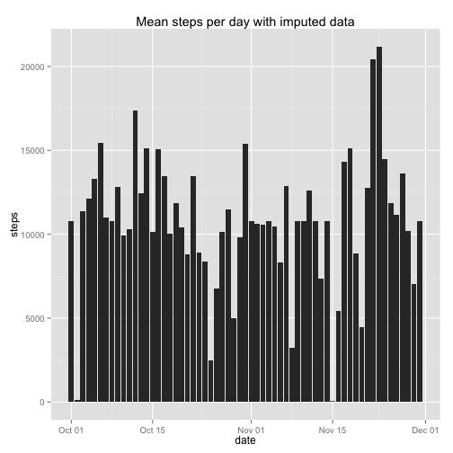
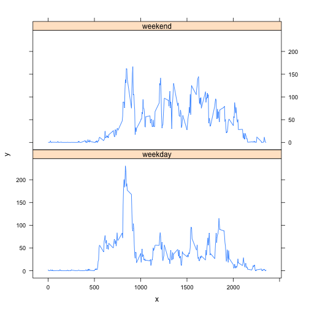

# Reproducible Research: Peer Assessment 1
First bring in required libraries

```r
library(ggplot2)
library(lattice)
```


## Loading and preprocessing the data


```r
# Read in the data
d = read.csv("activity.csv", header = TRUE, colClasses = c("numeric", "Date", 
    "numeric"))
```


## What is mean total number of steps taken per day?
The following chart shows the total steps by day.  Note that it is a bar chart, not a histogram.  A histogram wouldn't make sense in showing total steps per day.

```r
stepsByDay <- aggregate(steps ~ date, d, sum)
ggplot(stepsByDay, aes(x = date, y = steps)) + geom_bar(stat = "identity") + 
    ggtitle("Total steps per day (with NAs)")
```

 

Mean number of steps taken daily (across the mean for each and avery day): 

```
## [1] 10766
```

Median number of steps taken daily (across the mean for each and avery day

```
## [1] 10765
```

Summary for the data frame used to plot the graph

```r
summary(stepsByDay)
```

```
##       date                steps      
##  Min.   :2012-10-02   Min.   :   41  
##  1st Qu.:2012-10-16   1st Qu.: 8841  
##  Median :2012-10-29   Median :10765  
##  Mean   :2012-10-30   Mean   :10766  
##  3rd Qu.:2012-11-16   3rd Qu.:13294  
##  Max.   :2012-11-29   Max.   :21194
```

Note that this checks with what I reported previously for the mean and median on the total steps chart<br/><br/>
<b>Now, I thought the question was vague in if the mean/median needed to be on the total # of steps per day, or if it was supposed to report the value of that for each day.  So, I'll do both.</b>


```r
meanStepsByDay <- aggregate(steps ~ date, d, mean)
names(meanStepsByDay)[2] <- "meanSteps"
medianStepsByDay <- aggregate(steps ~ date, d, median)
names(medianStepsByDay)[2] <- "medianSteps"
meanAndMedianStepsByDay <- cbind(meanStepsByDay, medianStepsByDay$medianSteps)
names(meanAndMedianStepsByDay)[3] <- "medianSteps"
meanAndMedianStepsByDay
```

```
##          date meanSteps medianSteps
## 1  2012-10-02    0.4375           0
## 2  2012-10-03   39.4167           0
## 3  2012-10-04   42.0694           0
## 4  2012-10-05   46.1597           0
## 5  2012-10-06   53.5417           0
## 6  2012-10-07   38.2465           0
## 7  2012-10-09   44.4826           0
## 8  2012-10-10   34.3750           0
## 9  2012-10-11   35.7778           0
## 10 2012-10-12   60.3542           0
## 11 2012-10-13   43.1458           0
## 12 2012-10-14   52.4236           0
## 13 2012-10-15   35.2049           0
## 14 2012-10-16   52.3750           0
## 15 2012-10-17   46.7083           0
## 16 2012-10-18   34.9167           0
## 17 2012-10-19   41.0729           0
## 18 2012-10-20   36.0938           0
## 19 2012-10-21   30.6285           0
## 20 2012-10-22   46.7361           0
## 21 2012-10-23   30.9653           0
## 22 2012-10-24   29.0104           0
## 23 2012-10-25    8.6528           0
## 24 2012-10-26   23.5347           0
## 25 2012-10-27   35.1354           0
## 26 2012-10-28   39.7847           0
## 27 2012-10-29   17.4236           0
## 28 2012-10-30   34.0938           0
## 29 2012-10-31   53.5208           0
## 30 2012-11-02   36.8056           0
## 31 2012-11-03   36.7049           0
## 32 2012-11-05   36.2465           0
## 33 2012-11-06   28.9375           0
## 34 2012-11-07   44.7326           0
## 35 2012-11-08   11.1771           0
## 36 2012-11-11   43.7778           0
## 37 2012-11-12   37.3785           0
## 38 2012-11-13   25.4722           0
## 39 2012-11-15    0.1424           0
## 40 2012-11-16   18.8924           0
## 41 2012-11-17   49.7882           0
## 42 2012-11-18   52.4653           0
## 43 2012-11-19   30.6979           0
## 44 2012-11-20   15.5278           0
## 45 2012-11-21   44.3993           0
## 46 2012-11-22   70.9271           0
## 47 2012-11-23   73.5903           0
## 48 2012-11-24   50.2708           0
## 49 2012-11-25   41.0903           0
## 50 2012-11-26   38.7569           0
## 51 2012-11-27   47.3819           0
## 52 2012-11-28   35.3576           0
## 53 2012-11-29   24.4688           0
```


```r
summary(meanAndMedianStepsByDay)
```

```
##       date              meanSteps      medianSteps
##  Min.   :2012-10-02   Min.   : 0.14   Min.   :0   
##  1st Qu.:2012-10-16   1st Qu.:30.70   1st Qu.:0   
##  Median :2012-10-29   Median :37.38   Median :0   
##  Mean   :2012-10-30   Mean   :37.38   Mean   :0   
##  3rd Qu.:2012-11-16   3rd Qu.:46.16   3rd Qu.:0   
##  Max.   :2012-11-29   Max.   :73.59   Max.   :0
```

The means are smaller than in the previous chart as they are the total steps per day avaraged across 61 days.<br/>
The medians are 0, which seemed odd.  To explain, take a look at the values on a particular day:

```r
d[d$date == "2012-10-23", ]$steps
```

```
##   [1]   0   0   0   0   4   0   0   0   0   0   0   0   0   0   0   0   0
##  [18]   0   0   0   5   0   0   0   0   0   0   0   0   0   0   0   0   0
##  [35]  10   0   0   0   0   0   0   0   0   0   0   0   0   0   0   0   0
##  [52]   0   0   0   0   0   0   0   0   0   0   0   0   0   0   0   0   0
##  [69]   0   0   0   0   7   0   0   0   0   0   0   0   0   0  10  12  38
##  [86]   0  27  18  56  12  96   7  27   4  40  84   0 190  79  15   0   0
## [103]  19   0  28  20   0  62 400 189   9 192  42   0   0   0   0  27  70
## [120]   0   0   0   0   0   0   0   0   0   0   0   0   0 260 182   8  66
## [137]   0   0  62 114  20  19   0 156 499  64 376 209   0   0   0   0   0
## [154]   0  13 346  50  40   0   0   0   0  17   7   0   0  79  95  50  71
## [171]   0   0   0   0   0  16 124   0   0   0 109   0   0   0 139  56 110
## [188]   0  75 276   0   0 154   0   0   0   0   0   0   0   0   0  36 116
## [205]  11   0   8 120   0   0 237 198 304   0   0 154   0   0   0   0   0
## [222]   0   0   0   0   0   0   0   0   0   0   0   0   0  33 451 432 146
## [239] 483 201   0   0  46   7   0   0   0  17  61   0   0   0   0   0  62
## [256]  28   0   0   0   0   0   0   0   0   0   0   0   0  18   0  26  55
## [273]   0   0   0   0   7   0   0   0   0   0   0   0   0   0   0   0
```

Median is the middle value, which seems to end up always being 0.  I'm not sure if it makes sense to sort this, but I'm going to leave it as-is.</br>
<b>In the end, this assigment is about creating the report, not if the data in the report is correct.</b>
## What is the average daily activity pattern?

```r
# calculate the mean steps in each interval
meanStepsByInterval <- aggregate(steps ~ interval, d, mean)
ggplot(meanStepsByInterval, aes(interval)) + geom_line(aes(y = steps)) + ggtitle("Average steps per interval")
```

 


```r
maxInterval <- meanStepsByInterval[which.max(meanStepsByInterval$steps), ]$interval
```

The interval with the maximum value is:

```
## [1] 835
```

With a maximum value of:

```
## [1] 206.2
```

## Imputing missing values


```r
# identify and count the number of NA's
nas <- is.na(d$steps)
whichNAs <- which(is.na(d$steps))
numNAs <- length(whichNAs)
```


Number of NA's in the 'steps' data

```
## [1] 2304
```

To fill in these values, I will use the average from all days in 
each specific interval.

I do this by first meerging those averages with the original data


```r
t <- merge(d, meanStepsByInterval, by = "interval")
t <- t[with(t, order(date, interval)), ]
```


This can bee seen in the first few rows of the table as the steps.y

```
##     interval steps.x       date steps.y
## 1          0      NA 2012-10-01 1.71698
## 63         5      NA 2012-10-01 0.33962
## 128       10      NA 2012-10-01 0.13208
## 205       15      NA 2012-10-01 0.15094
## 264       20      NA 2012-10-01 0.07547
## 327       25      NA 2012-10-01 2.09434
```


Now, wherever steps.x is NA, put the value of steps.y into that column / variable.
I also rename the steps.x column to steps


```r
t$steps.x[is.na(t$steps.x)] <- t$steps.y[is.na(t$steps.x)]
names(t)[names(t) == "steps.x"] <- "steps"
t <- t[, -which(names(t) %in% c("steps.y"))]
```

Now the imported data is rolled up for a graph, and the median and mean is computed of this imputed steps column

```r
imputedStepsByDay <- aggregate(steps ~ date, t, sum)
imputedMeanStepsPerDay <- mean(imputedStepsByDay$steps)
imputedMedianStepsPerDay <- median(imputedStepsByDay$steps)
```

The plot of this data:

```r
ggplot(imputedStepsByDay, aes(x = date, y = steps)) + geom_bar(stat = "identity") + 
    ggtitle("Mean steps per day with imputed data")
```

 

Mean number of steps taken daily: 

```
## [1] 10766
```

Median number of steps taken daily

```
## [1] 10766
```

From the assignment, a couple of questions.<br/><br/>
<b>Interestingly, these are not part of the grading ruberic.  So, my analysis is for my own kicks, and compare the mean/medians as applied across the the total steps for each day in the old set and this new set with a NAs replaced</b><br/><br/>
<i><b>Do these values differ from the estimates from the first part of the assignment?</b></i><br/>
Yes.  The mean value is the same, which make sense as I inserted new means values which would not change the mean.
The median is different, as the number of data points in that set is different, and hence a different value gets selected.

<i><b>What is the impact of imputing missing data on the estimates of the total daily number of steps?</b></i><br/>
It gave an informed guess as the missing data.  It didn't change the outcome statisic in a significant way, which I think is good in this case as that data can be simulated without effecting the experiment.
## Are there differences in activity patterns between weekdays and weekends?
My R coding here isn't the best, but it worked, and I'm learning.

```r
# what days are weekends?
weekendDays = c("Saturday", "Sunday")

# creator vector of which days in the data are weekdays (FALSE) or a weekend
# (TRUE)
isweekend <- weekdays(t$date) %in% weekendDays
# add that a s column to the data frame
t$isweekend <- isweekend

# now, aggregate (apply means) by steps ~ interval create one object for
# weekends and one for the weekday means
weekdayMeans <- aggregate(steps ~ interval, t[!t$isweekend, ], mean)
weekendMeans <- aggregate(steps ~ interval, t[t$isweekend, ], mean)
# in those resullts inform that it is eeither a weekday or weekend
weekdayMeans$isweekend <- FALSE
weekendMeans$isweekend <- TRUE

# now, I'm concatenating those wables
comparison <- rbind(weekdayMeans, weekendMeans)

# this array is used by the plot to identify which is a weekend, by as a
# factor
isweekend <- comparison$isweekend
isweekend <- factor(isweekend, labels = c("weekday", "weekend"))

# now plot the data
x <- comparison$interval
y <- comparison$steps
xyplot(y ~ x | isweekend, layout = c(1, 2), type = "l")
```

 


### This plot show our subject is less active during many hours over the weekend
