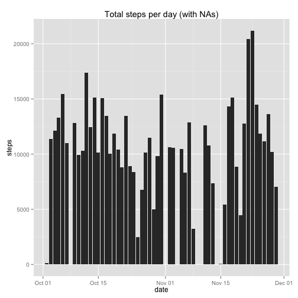
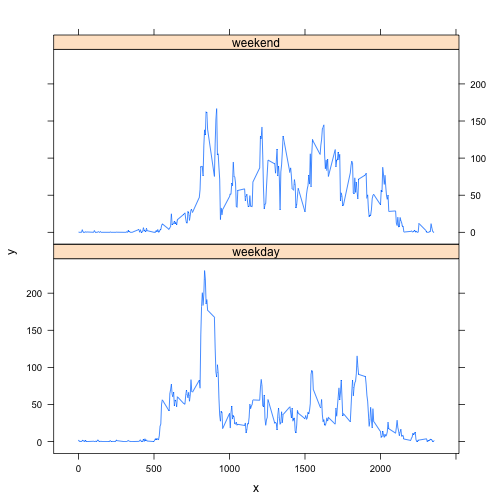

# Reproducible Research: Peer Assessment 1


```r
library(ggplot2)
library(lattice)
```


## Loading and preprocessing the data


```r
# Read in the data
d = read.csv("activity.csv")

# convert a few fields into numbers and dates
d$interval <- as.numeric(as.character(d$interval))
d$steps <- as.numeric(as.character(d$steps))
d$date <- as.Date(d$date)
```


## What is mean total number of steps taken per day?


```r
stepsByDay <- aggregate(steps ~ date, d, sum)
ggplot(stepsByDay, aes(x = date, y = steps)) + geom_bar(stat = "identity")
```

 

```r
meanStepsPerDay <- mean(stepsByDay$steps)
medianStepsPerDay <- median(stepsByDay$steps)
```

Mean number of steps taken daily: 

```
## [1] 10766
```

Median number of steps taken daily

```
## [1] 10765
```


## What is the average daily activity pattern?

```r
# calculate the mean steps in each interval
meanStepsByInterval <- aggregate(steps ~ interval, d, mean)
ggplot(meanStepsByInterval, aes(interval)) + geom_line(aes(y = steps))
```

 


```r
maxInterval <- meanStepsByInterval[which.max(meanStepsByInterval$steps), ]$interval
```

The interval with the maximum value is:

```
## [1] 835
```

With a maximum value of:

```
## [1] 206.2
```

## Imputing missing values


```r
# identify and count the number of NA's
nas <- is.na(d$steps)
whichNAs <- which(is.na(d$steps))
numNAs <- length(whichNAs)
```


Number of NA's in the 'steps' data

```
## [1] 2304
```

To fill in these values, I will use the average from all days in 
each specific interval.

I do this by first meerging those averages with the original data


```r
t <- merge(d, meanStepsByInterval, by = "interval")
t <- t[with(t, order(date, interval)), ]
```


This can bee seen in the first few rows of the table as the steps.y

```
##     interval steps.x       date steps.y
## 1          0      NA 2012-10-01 1.71698
## 63         5      NA 2012-10-01 0.33962
## 128       10      NA 2012-10-01 0.13208
## 205       15      NA 2012-10-01 0.15094
## 264       20      NA 2012-10-01 0.07547
## 327       25      NA 2012-10-01 2.09434
```


Now, wherever steps.x is NA, put the value of steps.y into that column / variable.
I also rename the steps.x column to steps


```r
t$steps.x[is.na(t$steps.x)] <- t$steps.y[is.na(t$steps.x)]
names(t)[names(t) == "steps.x"] <- "steps"
t <- t[, -which(names(t) %in% c("steps.y"))]
```

Now the imported data is rolled up for a graph, and the median and mean is computed of this imputed steps column

```r
imputedStepsByDay <- aggregate(steps ~ date, t, sum)
imputedMeanStepsPerDay <- mean(imputedStepsByDay$steps)
imputedMedianStepsPerDay <- median(imputedStepsByDay$steps)
```

The plot of this data:

```r
ggplot(imputedStepsByDay, aes(x = date, y = steps)) + geom_bar(stat = "identity")
```

 

Mean number of steps taken daily: 

```
## [1] 10766
```

Median number of steps taken daily

```
## [1] 10766
```

From the assignment, a couple of questions:
<i>Do these values differ from the estimates from the first part of the assignment?</i>
Yes.  The mean value is the same, which make sense as I inserted new means values which would not change the mean.
The median is different, as the number of data points in that set is different, and hence a different value gets selected.

<i>What is the impact of imputing missing data on the estimates of the total daily number of steps?</i>
It gave an informed guess as the missing data.  It didn't change the outcome statisic in a significant way, which I think is good in this case as that data can be simulated without effecting the experiment.
## Are there differences in activity patterns between weekdays and weekends?
My R coding here isn't the best, but it worked.

```r
# what days are weekends?
weekendDays = c("Saturday", "Sunday")

# creator vector of which days in the data are weekdays (FALSE) or a weekend
# (TRUE)
isweekend <- weekdays(t$date) %in% weekendDays
# add that a s column to the data frame
t$isweekend <- isweekend

# now, aggregate (apply means) by steps ~ interval create one object for
# weekends and one for the weekday means
weekdayMeans <- aggregate(steps ~ interval, t[!t$isweekend, ], mean)
weekendMeans <- aggregate(steps ~ interval, t[t$isweekend, ], mean)
# in those resullts inform that it is eeither a weekday or weekend
weekdayMeans$isweekend <- FALSE
weekendMeans$isweekend <- TRUE

# now, I'm concatenating those wables
comparison <- rbind(weekdayMeans, weekendMeans)

# this array is used by the plot to identify which is a weekend, by as a
# factor
isweekend <- comparison$isweekend
isweekend <- factor(isweekend, labels = c("weekday", "weekend"))

# now plot the data
x <- comparison$interval
y <- comparison$steps
xyplot(y ~ x | isweekend, layout = c(1, 2), type = "l")
```

 


### This plot show our subject is less active during many hours during weekend
